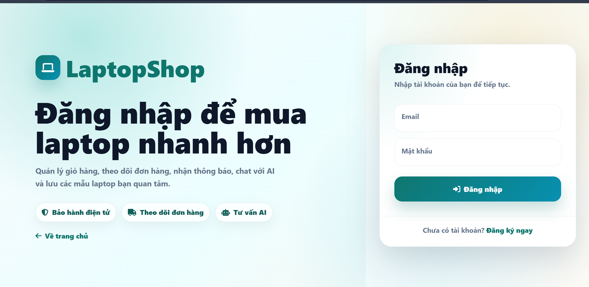
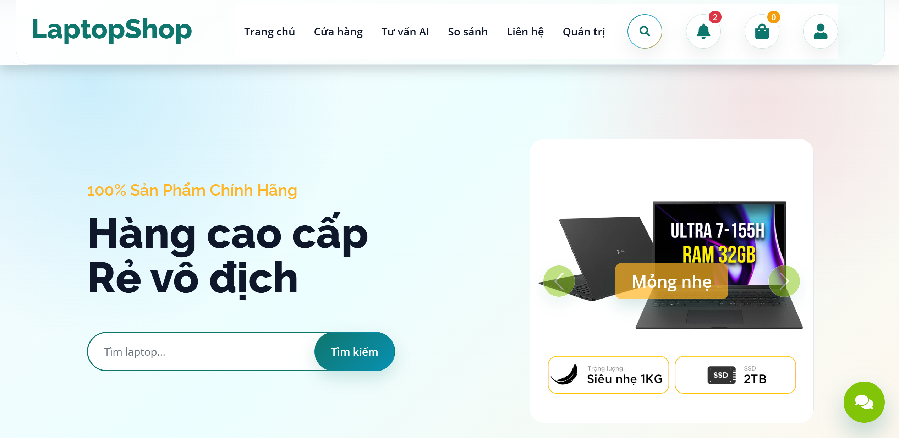
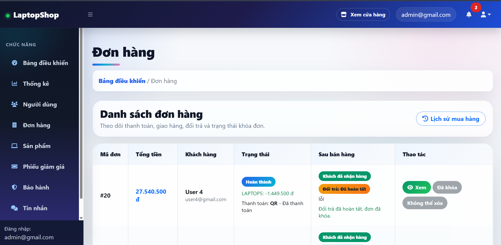
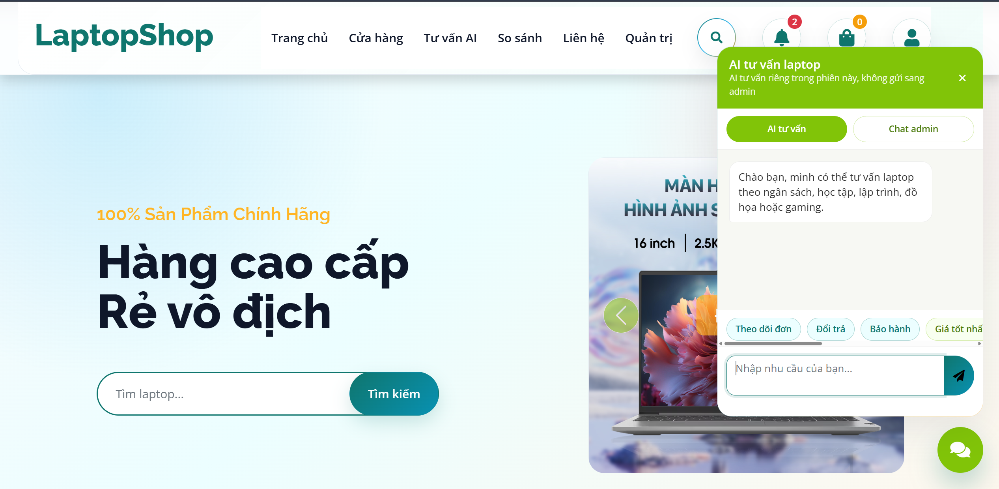
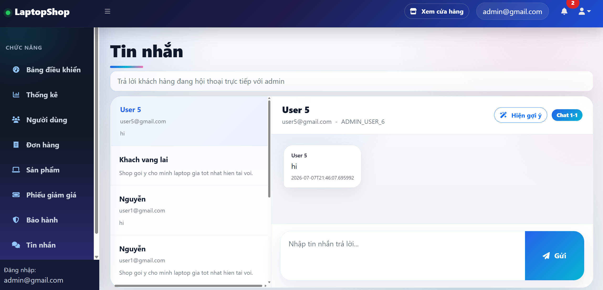
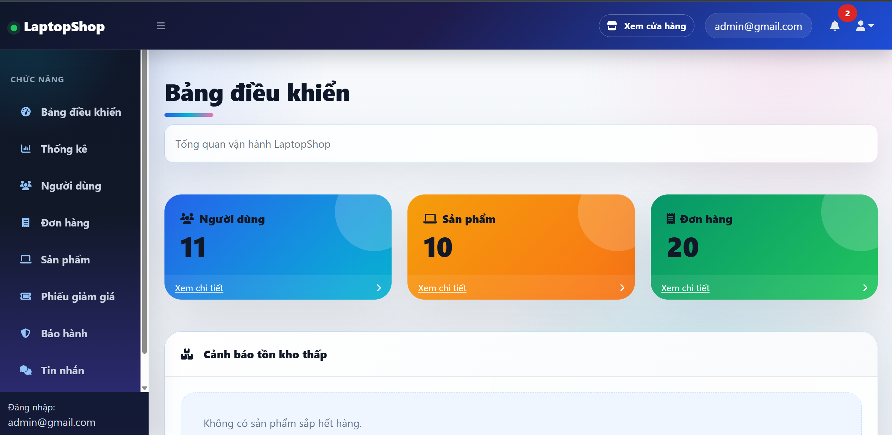
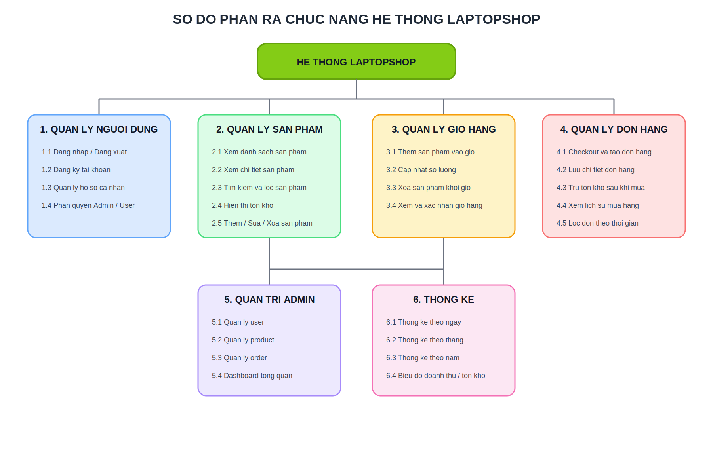

# LaptopShop

LaptopShop la website ban laptop duoc xay dung bang Spring Boot MVC, JSP/JSTL va MySQL. Du an ho tro day du luong mua hang co ban cho khach hang, trang quan tri cho admin, goi y laptop bang AI, chat realtime voi admin va cac chuc nang ho tro sau ban hang.

## Cong nghe su dung

- Java 17
- Spring Boot 3.2.2
- Spring MVC, Spring Data JPA, Spring Security
- Spring WebSocket
- Spring Session JDBC
- JSP, JSTL, Bootstrap, JavaScript
- MySQL
- OpenAI API cho tinh nang AI chat/goi y
- Maven Wrapper

## Namespace du an

Package chinh cua source code:

```text
datt.nguyenthanhlong.laptopshop
```

Metadata Maven:

```xml
<groupId>datt.nguyenthanhlong</groupId>
<artifactId>laptopshop</artifactId>
```

## Chuc nang chinh

### Khach hang

- Dang ky, dang nhap, dang xuat va phan quyen tai khoan.
- Xem trang chu, danh sach laptop va chi tiet san pham.
- Tim kiem, loc va phan trang san pham.
- Them san pham vao gio hang, cap nhat so luong va dat hang.
- Xem lich su don hang va tien trinh xu ly don.
- So sanh laptop.
- Them san pham vao wishlist.
- Danh gia san pham.
- Gui yeu cau bao hanh.
- Su dung voucher giam gia khi dat hang.
- Tim laptop phu hop theo nhu cau qua trang AI finder.
- Chat voi tro ly AI va lien he admin qua kenh chat realtime.

### Quan tri vien

- Dashboard tong quan doanh thu, don hang, san pham va nguoi dung.
- Quan ly nguoi dung.
- Quan ly san pham va upload anh san pham.
- Quan ly don hang, cap nhat trang thai don va theo doi lich su trang thai.
- Quan ly voucher giam gia.
- Quan ly yeu cau bao hanh.
- Theo doi va phan hoi tin nhan AI/chat cua khach hang.

## Anh giao dien

### Dang nhap

<p align="center">
  
</p>

### Giao dien khach hang

<p align="center">
  
  
</p>

### Tinh nang AI va chat

<p align="center">
  
  
</p>

### Giao dien quan tri

<p align="center">
  
</p>

### So do phan tich

<p align="center">
  
</p>

## Cau truc thu muc

```text
src/main/java/datt/nguyenthanhlong/laptopshop
├── config        # Cau hinh MVC, Security, WebSocket, filter, khoi tao du lieu
├── controller    # Controller cho client, admin va error page
├── domain        # Entity va DTO
├── repository    # Spring Data JPA repository
└── service       # Business logic, AI, upload, notification, order, product

src/main/webapp
├── WEB-INF/view  # JSP view cho client va admin
└── resources     # CSS, JavaScript, image, library frontend
```

## Yeu cau moi truong

- JDK 17 tro len
- MySQL 8.x
- Maven Wrapper co san trong du an (`mvnw`, `mvnw.cmd`)
- OpenAI API key neu muon dung day du tinh nang AI

## Cau hinh ung dung

File cau hinh chinh nam tai:

```text
src/main/resources/application.properties
```

Mac dinh du an ket noi MySQL theo cau hinh:

```properties
spring.datasource.url=jdbc:mysql://${MYSQL_HOST:localhost}:3306/laptopshop
spring.datasource.username=root
spring.datasource.password=123456
spring.jpa.hibernate.ddl-auto=update
```

Neu can doi thong tin database, hay sua cac gia tri tren cho dung voi may cua ban.

Bien moi truong cho AI:

```text
OPENAI_API_KEY=your_api_key
OPENAI_MODEL=gpt-4.1
```

Neu khong cau hinh `OPENAI_API_KEY`, cac chuc nang goi API AI co the khong hoat dong day du.

## Khoi tao database

Tao database MySQL:

```sql
CREATE DATABASE laptopshop CHARACTER SET utf8mb4 COLLATE utf8mb4_unicode_ci;
```

Khi chay ung dung, Hibernate se tu dong cap nhat schema theo entity vi du an dang dung:

```properties
spring.jpa.hibernate.ddl-auto=update
```

Du an co lop khoi tao du lieu tai:

```text
src/main/java/datt/nguyenthanhlong/laptopshop/config/DataInitializer.java
```

## Cach chay du an

Tren Windows:

```powershell
.\mvnw.cmd spring-boot:run
```

Tren macOS/Linux:

```bash
./mvnw spring-boot:run
```

Sau khi chay thanh cong, mo trinh duyet tai:

```text
http://localhost:8080
```

## Kiem thu va dong goi

Chay test:

```bash
./mvnw test
```

Dong goi ung dung:

```bash
./mvnw clean package
```

File build se nam trong thu muc:

```text
target/
```

## Ghi chu khi phat trien

- View JSP duoc dat trong `src/main/webapp/WEB-INF/view`.
- Static resource duoc dat trong `src/main/webapp/resources`.
- Anh san pham/avatar upload duoc luu trong cac thu muc con cua `src/main/webapp/resources/images`.
- Session dang dung Spring Session JDBC, schema session se duoc khoi tao tu dong.
